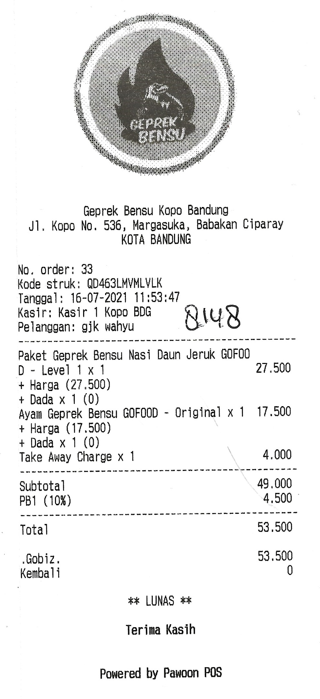
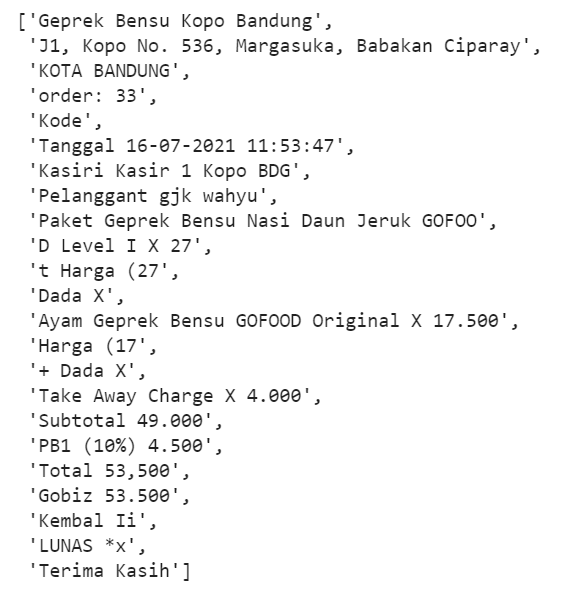

# Optical Character Recognition for Receipt

## Sample Results
Input Image             |  Output
:----------------------:|:----------------------:
  |  

## References

| Title                                                                                   | Author           | Year | Github | Paper | Download Model|
| ----------------------------------------------------------------------------------------| ---------------- | ---- | --------- | ----- |  -------- | 
| Character Region Awareness for Text Detection                                           | Clova AI Research, NAVER Corp.| 2019 | https://github.com/clovaai/CRAFT-pytorch | https://arxiv.org/abs/1904.01941 | [craft_mlt_25k.pth](https://drive.google.com/file/d/1Jk4eGD7crsqCCg9C9VjCLkMN3ze8kutZ/view)|
| What Is Wrong With Scene Text Recognition Model Comparisons? Dataset and Model Analysis | Clova AI Research, NAVER Corp.| 2019 | https://github.com/clovaai/deep-text-recognition-benchmark | https://arxiv.org/abs/1904.01906 | [TPS-ResNet-BiLSTM-Attn-case-sensitive.pth](https://www.dropbox.com/sh/j3xmli4di1zuv3s/AAArdcPgz7UFxIHUuKNOeKv_a?dl=0) |

## Folder structure
```
.
├─ configs               
|  ├─ craft_config.yaml  
|  └─ star_config.yaml   
├─ data
|  ├─ sample_output.jpg  
|  └─ tes.jpg
├─ notebooks                          
|  ├─ export_onnx_model.ipynb         
|  ├─ inference_default_engine.ipynb  
|  ├─ inference_onnx_engine.ipynb     
|  └─ test_api.ipynb                  
├─ src                                                               
|  ├─ text_detector                                         
|  │  ├─ basenet                                           
|  │  │  ├─ __init__.py                           
|  │  │  └─ vgg16_bn.py                           
|  │  ├─ modules                                              
|  │  │  ├─ __init__.py                           
|  │  │  ├─ craft.py                              
|  │  │  ├─ craft_utils.py                        
|  │  │  ├─ imgproc.py                            
|  │  │  ├─ refinenet.py                          
|  │  │  └─ utils.py                              
|  │  ├─ __init__.py                              
|  │  ├─ infer.py                                 
|  │  └─ load_model.py                            
|  ├─ text_recognizer                                           
|  │  ├─ modules                                              
|  │  │  ├─ dataset.py                            
|  │  │  ├─ feature_extraction.py                 
|  │  │  ├─ model.py                              
|  │  │  ├─ model_utils.py                        
|  │  │  ├─ prediction.py                         
|  │  │  ├─ sequence_modeling.py                  
|  │  │  ├─ transformation.py                     
|  │  │  └─ utils.py                              
|  │  ├─ __init__.py                              
|  │  ├─ infer.py                                 
|  │  └─ load_model.py                            
|  ├─ __init__.py                                 
|  ├─ engine.py                                   
|  └─ model.py                                    
├─ .gitignore
├─ CONTRIBUTING.md
├─ Dockerfile
├─ environment.yaml
├─ LICENSE
├─ main.py
├─ pyproject.toml
├─ README.md
├─ requirements.txt
├─ setup.cfg
```

## Model Preparation
You need to create "models" folder to store this:
- detector_model = "models/text_detector/craft_mlt_25k.pth"
- recognizer_model = "models/text_recognizer/TPS-ResNet-BiLSTM-Attn-case-sensitive.pth"

Download all of pretrained models from "References" section

## Requirements
You can setup the environment using conda or pip
```
pip install -r requirements.txt
```
or
```
conda env create -f environment.yaml
```

## Container
```
docker build -t receipt-ocr .
docker run -d --name receipt-ocr-service -p 80:80 receipt-ocr
docker start receipt-ocr-service
docker stop receipt-ocr-service
```
通过使用 Kivy（一个用于开发跨平台应用程序的 Python 框架）和 Buildozer（一个将 Python 应用程序打包成 Android APK 的工具），来实现这一目标。
步骤概述

    安装 Kivy 和 Buildozer
    转换代码以适应 Kivy
    创建 Buildozer 配置文件
    编译和打包

详细步骤
1. 安装 Kivy 和 Buildozer

确保你有一个干净的 Python 环境（推荐使用 virtualenv）。然后安装 Kivy 和 Buildozer。

sh

# 安装 Kivy
pip install kivy

# 安装 Buildozer
pip install buildozer

在 Linux 上，你可能需要一些额外的依赖项：

sh

sudo apt-get install -y python3-pip python3-dev build-essential git \
    libssl-dev libffi-dev python3-venv libgl1-mesa-dev libgles2-mesa-dev \
    zlib1g-dev libncurses5-dev libgdbm-dev libc6-dev libsqlite3-dev tk-dev \
    libgdm-dev libdb4o-cil-dev libpcap-dev libxcb-xinerama0

2. 转换代码以适应 Kivy

将你的 FastAPI 应用改造成一个 Kivy 应用。以下是一个简单的示例，演示如何将图像加载和处理功能集成到 Kivy 应用中。

python

from kivy.app import App
from kivy.uix.boxlayout import BoxLayout
from kivy.uix.button import Button
from kivy.uix.image import Image as KivyImage
from kivy.uix.textinput import TextInput
from kivy.core.image import Image as CoreImage
from kivy.core.window import Window

import base64
import io
from PIL import Image
import numpy as np

from src.engine import DefaultEngine
from src.model import DefaultModel

# 配置路径
DETECTOR_CFG = "configs/craft_config.yaml"
DETECTOR_MODEL = "models/text_detector/craft_mlt_25k.pth"
RECOGNIZER_CFG = "configs/star_config.yaml"
RECOGNIZER_MODEL = "models/text_recognizer/TPS-ResNet-BiLSTM-Attn-case-sensitive.pth"

# 初始化模型和引擎
model = DefaultModel(DETECTOR_CFG, DETECTOR_MODEL, RECOGNIZER_CFG, RECOGNIZER_MODEL)
engine = DefaultEngine(model)

class OCRApp(App):
    def build(self):
        self.title = 'OCR App'
        layout = BoxLayout(orientation='vertical')

        self.image_display = KivyImage()
        layout.add_widget(self.image_display)

        self.text_input = TextInput(hint_text='Enter base64 image string here', multiline=False)
        layout.add_widget(self.text_input)

        process_button = Button(text='Process Image')
        process_button.bind(on_press=self.process_image)
        layout.add_widget(process_button)

        return layout

    def process_image(self, instance):
        base64_image = self.text_input.text
        img_bytes = base64.b64decode(base64_image.encode('utf-8'))
        image = Image.open(io.BytesIO(img_bytes))
        image_np = np.array(image)

        engine.predict(image_np)
        result = engine.result

        # 显示处理后的图像（仅示例，实际操作根据需要调整）
        core_image = CoreImage(io.BytesIO(base64.b64decode(base64_image)), ext='png')
        self.image_display.texture = core_image.texture

        print(result)

if __name__ == '__main__':
    OCRApp().run()

3. 创建 Buildozer 配置文件

使用 Buildozer 初始化项目：

sh

buildozer init

这将创建一个 buildozer.spec 文件，打开它并进行适当的配置：

ini

[app]
title = OCRApp
package.name = ocrapp
package.domain = org.example
source.include_exts = py,png,jpg,kv,atlas
version = 0.1
requirements = python3,kivy,pillow,numpy

[buildozer]
log_level = 2
warn_on_root = 1

根据需要调整 requirements 和其他设置。
4. 编译和打包

在终端中运行以下命令以编译和打包 APK：

sh

buildozer -v android debug

成功编译后，APK 文件将出现在 bin/ 目录中。
额外注意事项

    依赖项管理：确保所有 Python 包在 buildozer.spec 文件中正确列出。
    模型文件和配置：将模型文件和配置文件打包到 APK 中，并确保路径正确。
    测试：在真实的 Android 设备上进行测试，以确保应用的所有功能正常工作。

总结

将一个 Python 项目转换为 Android 应用程序需要一定的调整和配置。通过使用 Kivy 和 Buildozer，可以将你的项目顺利转换为 Android APK。希望这个指南能帮助你完成这一任务。
